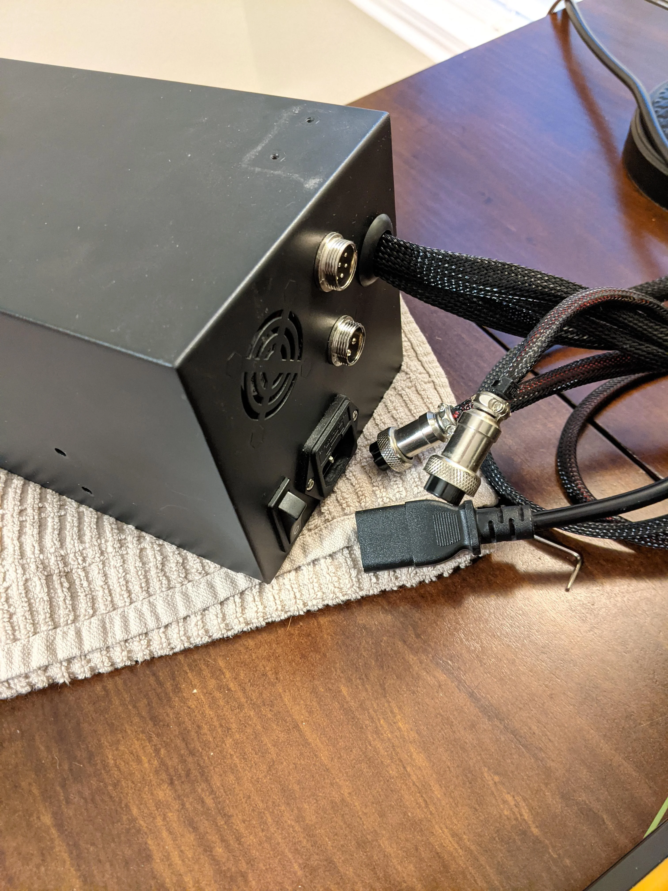
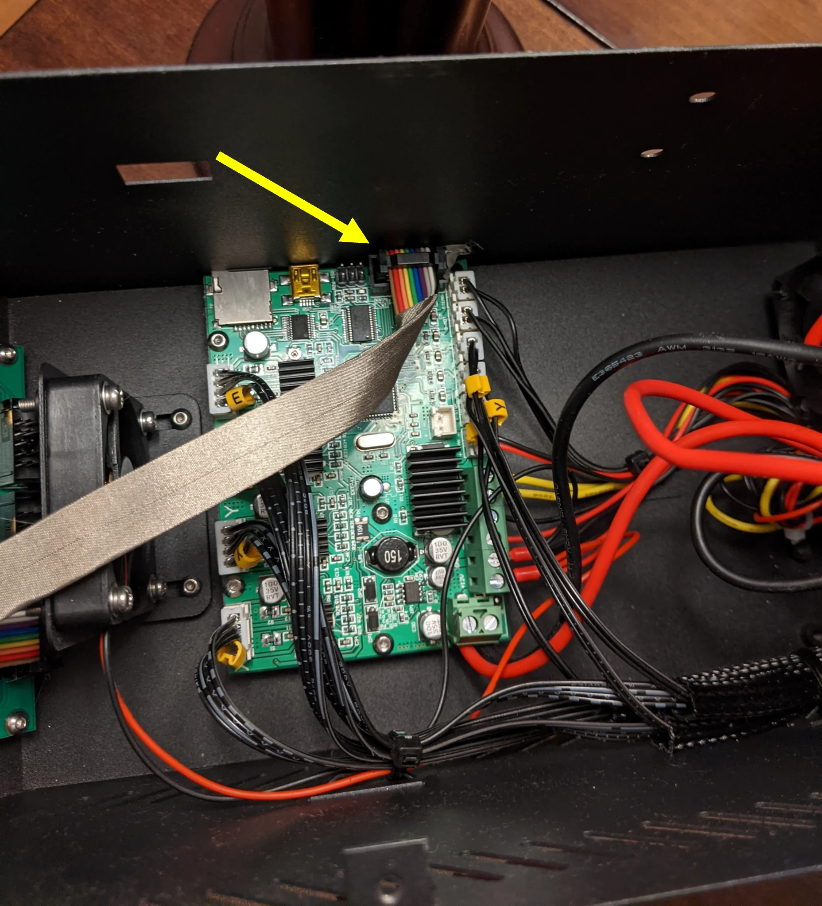
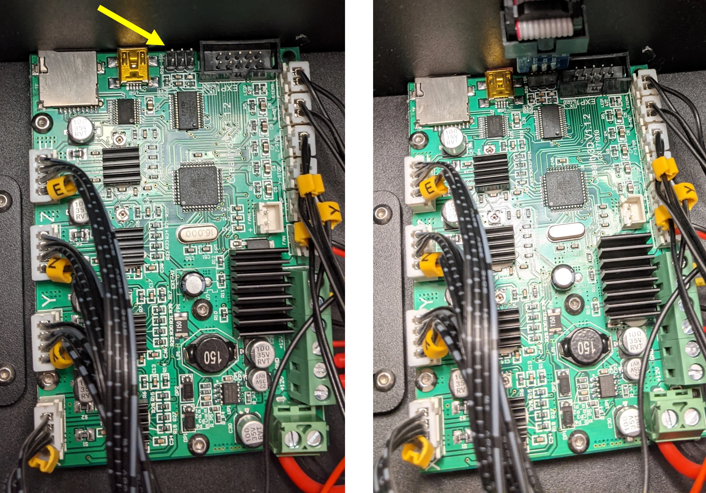

# Filament
Default filament dia is set to 3 !

# With inductive probe !
#define FIX_MOUNTED_PROBE

# How to flash

## Flash a Bootloader
<!-- https://www.reddit.com/r/CR10/comments/nkfbtq/cr10_usbtinyisp_arduinoisp_usb_bootloader/    -->
<!-- https://support.th3dstudio.com/helpcenter/creality-v2-0-v2-1-v2-2-board-atmel-2560-icsp-programming-header-pinout/ -->

These boards require a bootloader to be flashed before you can upload firmware to the board. This is a quick process and is only needed to be done once. After the bootloader is installed you will not need to update it again.

What you will need:

- USBasp
- Download Arduino IDE (ISP) https://www.arduino.cc/en/software
- Download Zadig https://zadig.akeo.ie/

Set up:

Assemble boot loader components

2. Disconnect the primary power cable and the two black power cables connected by threaded couplings from the back of the power supply


3. Open CR-10 control box by removing the 4 screws on the bottom of the control box

4. Free the power supply by removing the 4 screws found on the right-hand side of the control box - Be careful when pulling out the power supply, if you pull too far, you may dislodge the short cables it is attached to.

5. Locate the motherboard and pull gently to remove the ribbon cable that connects to the LCD screen


6. Plug in the boot loader and make sure the red stripe on the ribbon cable is pointed to the left.


7. Launch Zadig to download the required drivers

- Select "USBasp" from the dropdown menu
- Use the arrows to select "WinUSB (v6.1.7600.16385)"
- Install the driver

**In ArduinoISP:**

- Plug in the USBasp

- Navigate to `Tools` > select `Board:` > select `Boards Manager`

- In the `Filter your search...` menu search for `Arduino AVR Boards`, install, and select `Close`

- Navigate to `Tools` > select `Board:` > select `Arduino AVR Boards` > select `Arduino MEGA 2560`

- Navigate to `Tools` > select `Processor:` > select `Arduino MEGA 2560`

- Navigate to `Tools` > select `Programmer:` -> select `USBasp`

- Navigate to `Tools` and select `Burn Bootloader`

- Bootloader installed!

## Firmware

- 


# backup
https://forums.creality3dofficial.com/download/cr-series/cr-10-s4/

```
G21    ; Units in mm
M149 C ; Units in Celsius

Filament settings: Disabled
M200 D1.75
M200 D0

Steps per unit:
M92 X80.00 Y80.00 Z400.00 E485.00

Maximum feedrates (units/s):
M203 X300.00 Y300.00 Z5.00 E50.00

Maximum Acceleration (units/s2):
M201 X300 Y300 Z100 E1000

Acceleration (units/s2): P<print_accel> R<retract_accel> T<travel_accel>
M204 P500.00 R500.00 T1000.00

Advanced: S<min_feedrate> T<min_travel_feedrate> B<min_segment_time_ms> X<max_xy_jerk> Z<max_z_jerk> E<max_e_jerk>
M205 S0.00 T0.00 B20000 X10.00 Y10.00 Z0.40 E5.00

Home offset:
M206 X0.00 Y0.00 Z0.00

Material heatup parameters:
M145 S0 H185 B45 F255

PID settings:
M301 P25.60 I2.28 D71.84
```
