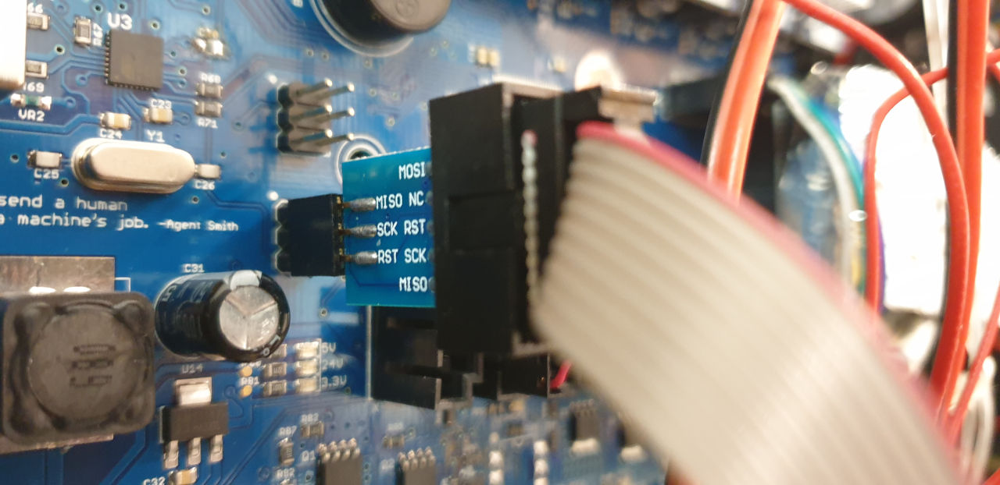

# How to flash

Use the atmega 1280 ISP pin headers on the mainboard



## Marlin Flash command: 
``` 
avrdude -p m1280 -c usbasp -e -U flash:w:firmware.hex
avrdude -p m1280 -c usbasp -e -U flash:w:firmware_c16d365_c16d3655bf_wanhao_dublicator_4s.hex
```

# Building @ platformm.io
The BOARD_MIGHTYBOARD_REVE is special, it uses pin that are not in the arduino build env. Use build env MightyBoard1280

## Orsinal Sailfish
```
# one 
# Please connect USBASP to motherbaord  8U2  ICSP1
avrdude -p at90usb82 -F -P usb -c usbasp -U lock:w:0x0F:m -U efuse:w:0xF4:m -U hfuse:w:0xD9:m -U lfuse:w:0xff:m -Uflash:w:Makerbot-usbserial.hex

# two
# Connect USBasp to 1280 ICSP2
avrdude -p m1280 -F -P usb -c usbasp -U flash:w:ATmegaBOOT_168_atmega1280.hex -U lfuse:w:0xff:m -U hfuse:w:0xD8:m -U efuse:w:0xF5:m -U lock:w:0x3F:m
```

# WARNING !!
firware is adjuded that the Y MAX LIMIT SWITCH is in the front of the machine, and not on its orginal place!


# USer Fans
NUM_M106_FANS is set to 1, and on build is a custom pins file used!

# Backup of Sailfish settings:

```xml
System Information
 ReplicatorG version: 0040
 Java version: 1.6.0_16

Machine
 Profile Name: The Replicator Dual
 Driver Type: MightyBoard
 Name: Wanhao Duplicatr
 Motherboard firmware version: Unknown v7.7
 Motherboard communication statistics
  Number of packets received from the USB interface:0
  Number of packets sent over the RS485 interface:0
  Number of packets sent over the RS485 interface that were not responded to:0
  Number of packet retries attempted:0
  Number of bytes received over the RS485 interface that were discarded as noise:0

Machine Driver XML:
<machine experimental="0">
		<name>The Replicator Dual</name>
		<geometry type="cartesian">
			<!-- different pulleys on X and Y axii -->
			<axis endstops="max" homingfeedrate="2500" id="x" length="227" maxfeedrate="18000" stepspermm="94.139704"/>  <!-- Pulley dia: 10.82mm / 1/8 step = 1/(10.82 * pi / 1600) -->
			<axis endstops="max" homingfeedrate="2500" id="y" length="148" maxfeedrate="18000" stepspermm="94.139704"/>  <!-- Pulley dia: 10.82mm / 1/8 step = 1/(10.82 * pi / 1600) -->
			<axis endstops="min" homingfeedrate="1100" id="z" length="150" maxfeedrate="1170" stepspermm="400"/> <!-- Actual length is 157mm, we reserve ~5mm for safety. TR-8x8 Z axis = 1/(8/1600) -->
			<axis endstops="none" id="a" length="100000" maxfeedrate="1600" stepspermm="96.275201870333662468889989185642"/> <!-- stepspermm is incoming filament length, see comment at bottom for explanation -->
			<axis endstops="none" id="b" length="100000" maxfeedrate="1600" stepspermm="96.275201870333662468889989185642"/> <!-- stepspermm is incoming filament length, see comment at bottom for explanation -->
		</geometry>
		<tools>
			<tool default_rpm="3" diameter="0.4" fan="true" heatedplatform="false" heater="true" index="1" model="Mk8" motor="true" motor_steps="3200" name="Mk8 Left" stepper_axis="b" type="extruder"/>
			<tool default_rpm="3" diameter="0.4" fan="true" heatedplatform="true" heater="true" index="0" model="Mk8" motor="true" motor_steps="3200" name="Mk8 Right" stepper_axis="a" type="extruder"/>
		</tools>
		<wipes>
			<wipe X1="-135.0" X2="-135.0" Y1="55.0" Y2="45.0" index="0" purge_duration="1000" purge_rpm="5.0" reverse_duration="15" reverse_rpm="35.0" wait="1000.0"/>
			<wipe X1="-135.0" X2="-135.0" Y1="55.0" Y2="45.0" index="1" purge_duration="1000" purge_rpm="5.0" reverse_duration="15" reverse_rpm="35.0" wait="1000.0"/>
		</wipes>
		<offsets>
			<offset xNozzle="33.0" yNozzle="0.0" zNozzle="0.0"/>
		</offsets>
		<clamps/>
		<driver name="mightyboard">
			<!-- optional: <portname>COM1</portname> -->
			<rate>115200</rate>
		</driver>
		<warmup>
		</warmup>
		<cooldown>
M18 (Turn off steppers after a build.)
		</cooldown>
		<bookend dualstart="machines/replicator/Dualstrusion_start.gcode" end="machines/replicator/Dual_Head_end.gcode" start="machines/replicator/Dual_Head_start.gcode"/>
	</machine>
```

        <!-- Dualstrusion_start.gcode -->
        (**** start.gcode for The Replicator, Dualstrusion! ****)
        M103 (disable RPM)
        M73 P0 (enable build progress)
        G21 (set units to mm)
        G90 (set positioning to absolute)
        M109 S110 T0 (set HBP temperature)
        M104 S220 T0 (set extruder temperature)
        M104 S220 T1 (set extruder temperature)
        (**** begin homing ****)
        G162 X Y F2500 (home XY axes maximum)
        G161 Z F1100 (home Z axis minimum)
        G92 Z-5 (set Z to -5)
        G1 Z0.0 (move Z to "0")
        G161 Z F100 (home Z axis minimum)
        M132 X Y Z A B (Recall stored home offsets for XYZAB axis)
        (**** end homing ****)
        G1 X-110.5 Y-74 Z50 F3300.0 (move to waiting position)
        G130 X20 Y20 Z20 A20 B20 (Lower stepper Vrefs while heating)
        M6 T0 (wait for toolhead, and HBP to reach temperature)
        M6 T1 (wait for toolhead, and HBP to reach temperature)
        G130 X127 Y127 Z40 A127 B127 (Set Stepper motor Vref to defaults)
        G0 X-110.5 Y-74     (Position Nozzle)
        G0 Z0.6         (Position Height)
        G1 E4 F50.0      (Create Anchor)
        G92 E0
        (**** end of start.gcode ****)

        <!-- Dual_Head_end.gcode -->
        (******* End.gcode*******)
        M73 P100 ( End  build progress )
        G0 Z150 ( Send Z axis to bottom of machine )
        M18 ( Disable steppers )
        M109 S0 T0 ( Cool down the build platform )
        M104 S0 T0 ( Cool down the Right Extruder )
        M104 S0 T1 ( Cool down the Left Extruder )
        G162 X Y F2500 ( Home XY endstops )
        M18 ( Disable stepper motors )
        M70 P5 ( We <3 Making Things!)
        M72 P1  ( Play Ta-Da song )
        (*********end End.gcode*******)

        <!-- Dual_Head_start.gcode -->
        (**** start.gcode for The Replicator, dual head ****)
        M103 (disable RPM)
        M73 P0 (enable build progress)
        G21 (set units to mm)
        G90 (set positioning to absolute)
        M109 S110 T0 (set HBP temperature)
        M104 S220 T0 (set extruder temperature)
        (**** begin homing ****)
        G162 X Y F2500 (home XY axes maximum)
        G161 Z F1100 (home Z axis minimum)
        G92 Z-5 (set Z to -5)
        G1 Z0.0 (move Z to "0")
        G161 Z F100 (home Z axis minimum)
        M132 X Y Z A B (Recall stored home offsets for XYZAB axis)
        (**** end homing ****)
        G1 X-110.5 Y-74 Z150 F3300.0 (move to waiting position)
        G130 X20 Y20 Z20 A20 B20 (Lower stepper Vrefs while heating)
        M6 T0 (wait for toolhead, and HBP to reach temperature)
        G130 X127 Y127 Z40 A127 B127 (Set Stepper motor Vref to defaults)
        M108 R3.0 T0
        G0 X-110.5 Y-74 (Position Nozzle)
        G0 Z0.6      (Position Height)
        M108 R5.0    (Set Extruder Speed)
        M101         (Start Extruder)
        G4 P2000     (Create Anchor)
        (**** end of start.gcode ****)

        <!-- Single_Head_end.gcode -->
        (******* End.gcode*******)
        M73 P100 ( End  build progress )
        G0 Z150 ( Send Z axis to bottom of machine )
        M18 ( Disable steppers )
        M104 S0 T0 ( Cool down the Right Extruder )
        M109 S0 T0 ( Cool down the platform)
        G162 X Y F2500 ( Home XY endstops )
        M18 ( Disable stepper motors )
        M70 P5 ( We <3 Making Things!)
        M72 P1  ( Play Ta-Da song )
        (*********end End.gcode*******)

        <!-- Single_Head_start.gcode -->
        (**** start.gcode for The Replicator, single head ****)
        M103 (disable RPM)
        M73 P0 (enable build progress)
        G21 (set units to mm)
        G90 (set positioning to absolute)
        M109 S110 T0 (set HBP temperature)
        M104 S220 T0 (set extruder temperature)
        (**** begin homing ****)
        G162 X Y F2500 (home XY axes maximum)
        G161 Z F1100 (home Z axis minimum)
        G92 Z-5 (set Z to -5)
        G1 Z0.0 (move Z to "0")
        G161 Z F100 (home Z axis minimum)
        M132 X Y Z A B (Recall stored home offsets for XYZAB axis)
        (**** end homing ****)
        G1 X-110.5 Y-74 Z150 F3300.0 (move to waiting position)
        G130 X20 Y20 Z20 A20 B20 (Lower stepper Vrefs while heating)
        M6 T0 (wait for toolhead, and HBP to reach temperature)
        G130 X127 Y127 Z40 A127 B127 (Set Stepper motor Vref to defaults)
        M108 R3.0 T0
        G0 X-110.5 Y-74 (Position Nozzle)
        G0 Z0.6      (Position Height)
        M108 R5.0    (Set Extruder Speed)
        M101         (Start Extruder)
        G4 P2000     (Create Anchor)
        (**** end of start.gcode ****)

